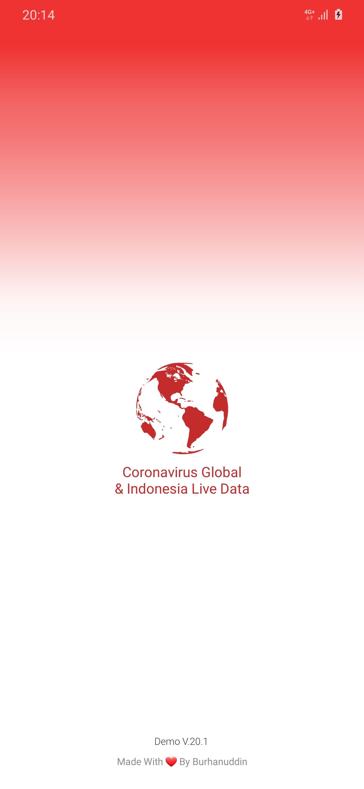
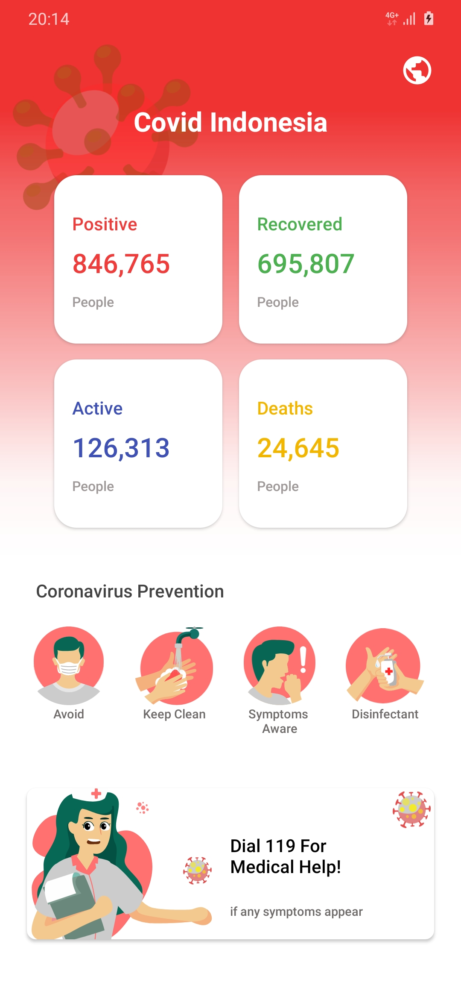
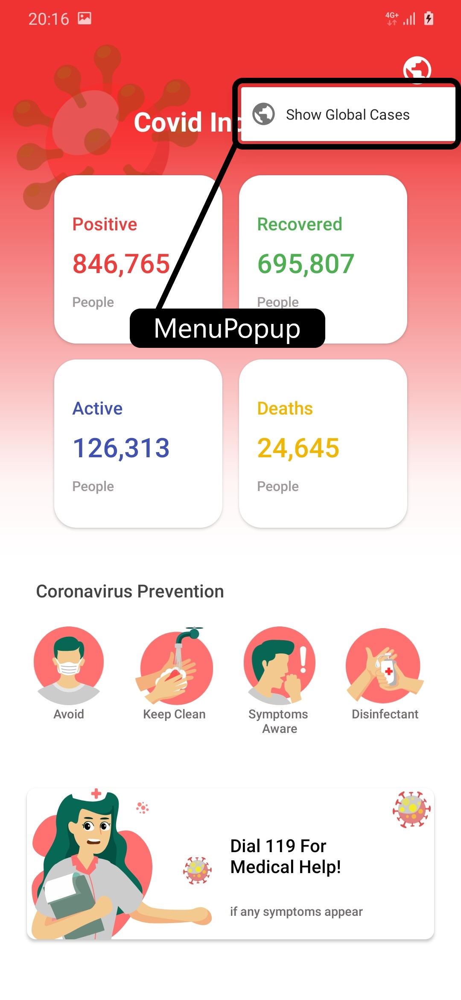
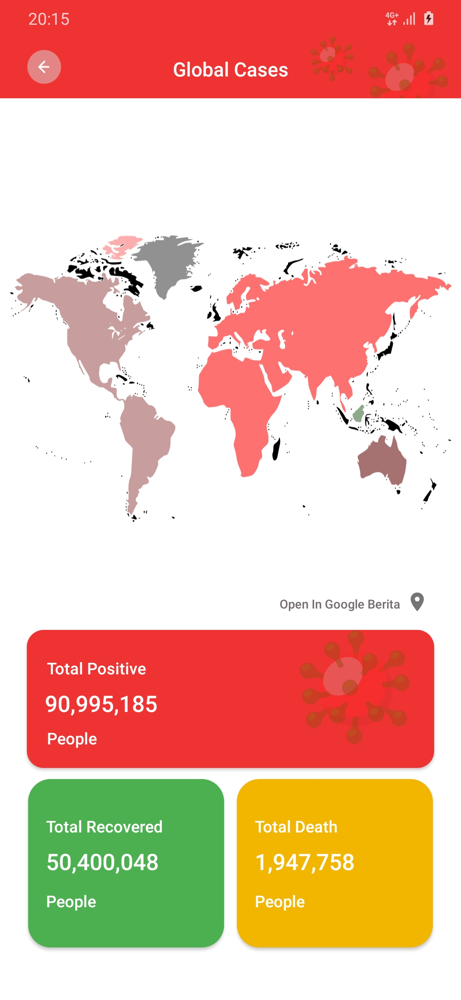
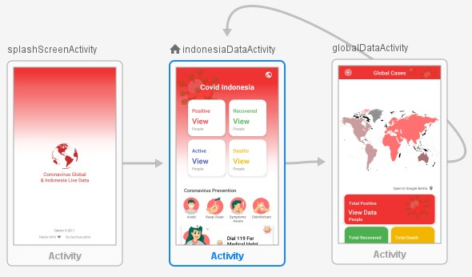

## Mobile Dashboard Coronavirus Live Data
[](https://opensource.org/licenses/BSD-2-Clause)<br>
Project Tugas Akhir UAS Pemrograman Berbasis Mobile <b>STMIK Akakom Yogyakarta</b>
## Penting &#10071;
- Sumber API dari https://kawalcorona.com/api/
- Project ini dibuat dengan menggunakan android `Android Studio 4.1.1 Build #AI-201.8743.12.41.6953283, built on November 5, 2020` Versi terbaru
saat project ini dibuat
- Dengen menggunakan `Kotlin Version 1.4.21-release-Studio4.1-1` <b>Kotlin Syintetic Deprecated</b>
- Pengembangan aplikasi `git clone https://github.com/04burhanuddin/Mobile-Dashboard-Coronavirus-LiveData.git`
- Aplikasi dapat di install sudah di sediakn build apk di folder utama .apk
- Biasakan <b>Memahami</b> terlebih dahulu sebelum copy paste biar tidak terjadi error &#x1F602;

## API SPECI
#### GET DATA INDONESIA
- Method : GET
- Endpoint : `https://api.kawalcorona.com/indonesia`
- Body :
  ```json
  [
    {
      "name" : "String",
      "positif" : "String",
      "sembuh" : "String",
      "meninggal" : "Stringr",
      "dirawat" : "String"
    }
  ]
  ```
- Response :
  ```json
  [
    {
      "positif" : "String",
      "sembuh" : "String",
      "meninggal" : "Stringr",
      "dirawat" : "String"
    }
  ]
  ```
#### GET GLOBAL POSITIF
- Method : GET
- Endpoint : `https://api.kawalcorona.com/positif`
- Response :
  ```json
  {
    "value": "307,278"
  }
  ```
#### GET GLOBAL SEMBUH
- Method : GET
- Endpoint : `https://api.kawalcorona.com/sembuh`
- Response :
  ```json
  {
    "value": "92,373"
  }
  ```
#### GET GLOBAL MENINGGAL
- Method : GET
- Endpoint : `https://api.kawalcorona.com/meninggal`
- Response :
  ```json
  {
    "value": "13,049"
  }
  ```
Pada bagian <b>Response</b> dimana saya tidak memasukkan `"name : "` Untuk setiap <i>Response</i> dikarenakan aplikasi yang dibuat berbahasa inggris sedangkan jika kita ingin
menampilkan name ke response tidak akan sesuai dikarenakan isi dari response name adalah menggunakan <b><i>Bhs. Indonesia</i></b>

## Tampilan Aplikasi
Aplikasi ini saya uji coba pada `Device` saya dengan ukuran layar `6.3 inch, 1440 x 3040 dengan android 10` dan ini kemungkina akan berbeda ketika di jalankan 
pada device yang lebih kecil dari device yang saya gunakan akan tetapi pada aplikasi ini sudha mendukung `ScrollView` &#128076; jadi jika di jalankan pada device yang lebih kecil
informasi yang ada pada aplikasi akan tetap tampil tanpa terpotong. 
- SplashScreen dan Dashboard

   
  
- Popup Menu dan GlobalCases

   

  

## Navigation
Berikut adalah nav grafikdari aplikasi ini



Dari Navigasi di atas dapat di lihat bahwa aplikasi ini hanya memiliki <b>3 Activity<b>

# Keep On Coding Off Sosmed&#128245; Mode On&#128187;
